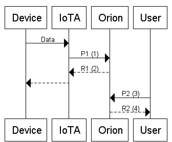
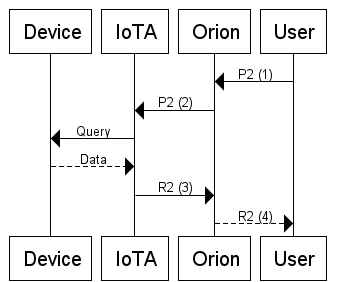
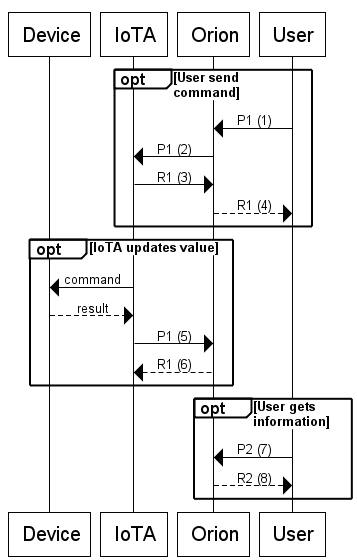

# Northbound NGSI Interactions

## Index

* [Overview](#overview)
* [Requirements](#requirements)
* [Theory](#theory)
  * [Overview](#theoryoverview)
  * [Data interaction payloads (NGSIv10)](#payloads)
  * [Scenario 1: active attributes](#scn1active)
  * [Scenario 2: lazy attributes](#scn2lazy)
  * [Scenario 3: command attributes](#scn3command)
  * [How to select an scenario](#scenarioselection)
* [Practice](#practice)
  * [Retrieving a token](#token)
  * [Scenario 1: active attributes (happy path)](#activehp)
  * [Scenario 1: active attributes (error)](#activeerror)
  * [Scenario 2: lazy attributes (happy path)](#lazyhp)
  * [Scenario 2: lazy attributes (error)](#lazyerror)
  * [Scenario 3: commands (happy path)](#commandshp)
  * [Scenario 3: commands (error)](#commandserror)

## <a name="overview"/> Overview
This document's target is to explain in detail how the IoTAgent interacts with the Context Broker in all the possible
IoT Scenarios that are supported by this library.

This document has two sections. In the first section, all the interaction models will be explained theoretically with
sequence diagrams, including the advantages and disadvantages of each one of them for different scenarios. The second
section will show examples of all those interactions, using command-line tools available in most OSs, like netcat and
curl.

All the examples have been created to work against Telefonica's IoT Platform so, along with the NGSI data, the following
information should always be sent:

* Headers for the service and subservice. A service "workshop" with subservice "/iotangsi" will be used.
* X-Auth-Token header with a valid unexpired token for a user that has admin permissions in the subservice. In this case
the user "adminiota2ngsi" will be used for all interactions

## <a name="requirements"/> Requirements
The practical part of this document has the following requirements:

* A Unix-line command line interpreter. All the workshop will take place in the command line, making use of different
command-line tools to simulate the different interactions.

* Curl command-line HTTP client should be installed.

* Netcat network utility should be installed.

* An accesible IoT Platform with the following configured components: Keystone, Steelskin PEP and Orion Context Broker.

* Basic knowledge of the NGSI model and HTTP interfaces.

## <a name="theory"/> Theory

### <a name="theoryoverview"/> Overview

#### General purpose of the IoT Agents
Inside the FIWARE Architecture, the IoT Agents work as protocol translation gateways, used to fill the gap between
South Bound protocols (typically lightweight protocols aimed to constrained devices) and the NGSI protocol used to
communicate FIWARE components. This translation process can be customized by the user with provisioning instructions,
using the Device Provisioning APIs.

So, all IoT Agents interacts with three different actors:
* **Devices**, in the South Bound
* **Users** through the Provisioning API
* and the **Context Broker**

In this document, we are going to focus on the NGSI interactions between the IoTAgents and the Context Broker, but
the three actors will appear eventually in sequence diagrams, as all of them take part at some point in the interactions.

All the interactions between the IoTAgents and the Context Broker are standard NGSI, as described in the
[Fiware Orion Context Broker manual](https://fiware-orion.readthedocs.io/en/master/user/walkthrough_apiv1/index.html#ngsi10-standard-operations).

The general purpose of the interactions between both components is:
* To map device information coming to the IoTA to NGSI entities in the Context Broker.
* To ask for device data from the Context Broker through the Context Provider mechanism.
* To send commands to devices based on modifications of the device entity in the Context Broker.

This interactions can be mapped to three different scenarios (that will be detailed in further sections).

#### Asynchronous interactions

Along this document, the term "asynchronous interaction" will be widely used, so we will define its specific meaning here.
Inside the scope of the IoTAgents documentation, an "asynchronous scenario" will have the following definition:

Asynchronous scenario

: The one in which the actor that initiates the communication leaves its HTTP socket open waiting for the response until all the interaction scenario ends, receiving the results through the same socket that initiated the request

### <a name="payloads"/> Data interaction payloads (NGSIv10)

There are only two kinds of possible data interactions between the IoTAgents and the Context Broker: the queryContext and
updateContext interactions described in NGSIv10. Lots of examples can be found in the
[Fiware Orion Context Broker manual](https://fiware-orion.readthedocs.io/en/master/user/walkthrough_apiv1/index.html#ngsi10-standard-operations)
but this section shows some examples of each one of them.

There are six different payloads that may appear in this interactions:

P1 - UpdateContext (request) - The payload of a request to POST /v1/updateContext
R1 - UpdateContext (response) - Always the answer to a successful POST /v1/updateContext
P2 - QueryContext (request) - he payload of a request to POST /v1/queryContext
R2 - QueryContext (response) - Always the answer to a successful POST /v1/queryContext
E1 - Error - Always the response to a request (both queryContext or updateContext)

No other type of payload can be issued in any interaction between this two components.

The following subsections will show examples of each one of them, with a brief explanation. Refer to the linked NGSI
documentation for more details.

#### P1 - UpdateContext (request)

This payload is associated to an update operation (POST /v1/updateContext).

```
{
    "contextElements": [
        {
            "type": "Room",
            "isPattern": "false",
            "id": "Room1",
            "attributes": [
                {
                    "name": "temperature",
                    "type": "float",
                    "value": "23"
                },
                {
                    "name": "pressure",
                    "type": "integer",
                    "value": "720"
                }
            ]
        }
    ],
    "updateAction": "APPEND"
}
```
As it can be seen in the example, the payload is a JSON Object with the following attributes:

* A `contextElements` attribute that contains the data that will be updated in the target entity in the `attributes`
attribute, along with the information needed to identify the target entity `id` and `type` attributes. This attribute
is an array, so a single updateContext operation can be used to update.

* An `updateAction` indicating the type of update: if this attribute has the value "APPEND" the appropriate entity and
attributes will be created if the don't exist; if the value is "UPDATE", an error will be thrown if the target resources
don't exist.

#### R1 - UpdateContext (response)

```
{
    "contextResponses": [
        {
            "contextElement": {
                "attributes": [
                    {
                        "name": "temperature",
                        "type": "float",
                        "value": ""
                    },
                    {
                        "name": "pressure",
                        "type": "integer",
                        "value": ""
                    }
                ],
                "id": "Room1",
                "isPattern": "false",
                "type": "Room"
            },
            "statusCode": {
                "code": "200",
                "reasonPhrase": "OK"
            }
        }
    ]
}
```
As the example shows, the response to an updateContext is basically an empty copy of the request payload, along with an
`statusCode` attribute indicating if the operation has succeeded (or a possible error).

Application level errors can be specified for each entity in this payload.


#### P2 - QueryContext (request)
This payload is associate to a query operation (POST /v1/queryContext).

```
{
    "entities": [
        {
            "type": "Room",
            "isPattern": "false",
            "id": "Room1"
        }
    ],
    "attributes": [
        "temperature"
    ]
}
```
The payload specifies the following information:

* The list of target entities whose information is going to be retrieved.
* The list of attributes of those entities that will be retrieved.


#### R2 - QueryContext (response)

```
{
    "contextResponses": [
        {
            "contextElement": {
                "attributes": [
                    {
                        "name": "temperature",
                        "type": "float",
                        "value": "23"
                    }
                ],
                "id": "Room1",
                "isPattern": "false",
                "type": "Room"
            },
            "statusCode": {
                "code": "200",
                "reasonPhrase": "OK"
            }
        }
    ]
}
```
In this case, the response to the QueryContext is a list of responses, one for each requested entity, indicating whether
the information has been retrieved successfully (in the `statusCode` field) and the requested Context information in the
`ContextElement` attribute.

Application level errors can be specified for each entity in this payload.

#### E1 - Error

```
{
    "errorCode": {
        "code": "404",
        "reasonPhrase": "No context element registrations found"
    }
}
```

This special payload can be used to specify general errors with the request, that are not associated to any particular
Context Element, but with the request as a whole.

### <a name="scn1active"/> Scenario 1: active attributes



Escenario 1º Atributos activos (Diagrama 1): creo que es lo que vosotros llamáis volcado. En este escenario,  el único
flujo de datos es de Hydra a Context Broker. Hydra envía un P1 y recibe un R1. Esta interacción es 100% síncrona. Eso
quiere decir que hay una única conexión HTTP desde Hydra al CB, en cuya request se envía P1 y en cuya response se
recibe R1 (todo en la misma conexión). Este flujo deja los datos en el Context Broker, de forma que, si un Usuario
desea consultarlos, puede hacerlo por medio de cualquier operación de la API NGSI del CB. Esta consulta de datos está
completamente desacoplada de la actualización (son dos operaciones distintas y no tienen por que venir seguidas en el
tiempo).

### <a name="scn2lazy"/> Scenario 2: lazy attributes



Escenario 2º Atributos pasivos (Diagrama 2): correspondería a lo que en vuestro anterior correo llamaríais 1.2. En este
caso, se supone que Hydra está registrada como Context Provider del atributo en cuestión. Esta interacción la empieza
el Usuario, haciendo una petición tipo P2 al Context Broker (1). Éste, al ver que hay un Context Provider registrado
para el atributo, reenvía la misma trama P2 exacta a Hydra (2). Hydra responde dentro de la misma conexión HTTP al
Context Broker, con un R2 (3). Este R2 es el que contiene toda la información solicitada por el usuario. El Context
Broker, a su vez, responde con el mismo R2 recibido, al Usuario, dentro de la misma conexión HTTP creada por el usuario
(4). Este escenario también es, por tanto, 100% síncrono (desde el punto de vista del que inicia la conexión que es el
usuario).

### <a name="scn3command"/> Scenario 3: commands



Escenario 3º Comandos (Diagrama 3): correspondería a lo que en vuestro correo anterior llamaríais 1.1. Aunque los
llamemos comandos, no dejan de ser un tipo de interacción más, con el que se puede solicitar información. También en
este caso, se supone que Hydra está registrada como Context Provider del atributo en cuestión. Al igual que en el caso
de los atributos pasivos, la interacción la inicia el Usuario de la plataforma, llamando al Context Broker con un
payload tipo P1 (1). El Context broker redirige este mismo payload al Context Provider del atributo (Hydra) (2) y éste
debe responder  dentro de la misma conexión HTTP al Context Broker, con un R1 (3). Esta respuesta no es la respuesta
definitiva a la consulta, y no contiene ninguna información útil aparte del código de respuesta. Contestar un código
200 OK en esta interacción HTTP implica que Hydra ha aceptado el comando, sabe que debe obtener esa información y
devolverla en algún momento del futuro. El Context Broker entonces redirige la misma respuesta R1 recibida de Hydra
al Usuario que inició la petición, y todas las conexiones HTTP se cierran (4). Transcurrido un tiempo arbitrario,
Hydra, de alguna forma, habrá obtenido los datos que se habían solicitado desde el Usuario. En ese momento, Hydra
inicia una nueva petición HTTP, enviando P1 al Context Broker (5). Este P1 es el que contiene la información
solicitada, y toda la metainformación asociada. El Context Broker devuelve R1 a esta petición, terminando así con la
interacción HTTP (6). El usuario puede entonces acceder a esa información por los mismos mecanismos estándar que podría
haber usado en el escenario 1 (7). En ese sentido, el Escenario 3º es en cierto modo una variante del Escenario 1º, en
el que el volcado no se inicia por causa del dispositivo, sino por solicitud del Usuario. Es importante señalar que
las tres partes de este escenario están completamente desacopladas.

### <a name="scenario selection"/> How to select an scenario

Escenario 1 - Todas las interacciones que empiecen en un dispositivo o en Hydra.
Escenario 2 - Interacciones iniciadas por el usuario que lleven poco tiempo (donde poco está en el orden de los segundos).
Escenario 3 - Interacciones iniciadas por el usuario que, potencialmente, puedan requerir de mucho tiempo para la respuesta.

Por último, hay que hacer el importante matiz de que un atributo para el cual Hydra se ha registrado como Context Provider, jamás debería ser actualizado con un APPEND desde ningún actor y jamás debería ser actualizado desde Hydra, en general (ya que se supone que es un atributo de entrada a hydra, no de salida). Por eso, en el caso del Escenario 3, la solicitud de actualización se debe hacer a un attributo que se llame distinto al atributo en el que Hydra contestará (en su momento ya dijimos que lo habitual es que uno se llame "atributo" y el otro "atributo_<sufijo>").

He omitido los payloads a propósito en este mail, porque me importa mucho más que entendamos todos cómo funciona cada flujo, y por las peticiones que llegan a soporte y lo que llega a los correos, me da la sensación de que no está claro. Como decía al principio, tipos de payloads hay 4, y las respuestas son prácticamente iguales que las peticiones, así que esto debería ser más claro, una vez entendido bien cómo funciona todo a alto nivel.

Una vez explicado todo esto, ¿queda alguna duda sobre el funcionamiento de la API que debería usar Hydra? ¿podéis exponerlas a la vista de lo que hemos comentado aquí?


## <a name="practice"/> Practice

### <a name="token"/> Retrieving a token

### <a name="activehp"/> Scenario 1: active attributes (happy path)

### <a name="activeerror"/> Scenario 1: active attributes (error)

### <a name="lazyhp"/> Scenario 2: lazy attributes (happy path)

### <a name="lazyerror"/> Scenario 2: lazy attributes (error)

### <a name="commandshp"/> Scenario 3: commands (happy path)

### <a name="commandserror"/> Scenario 3: commands (error)

